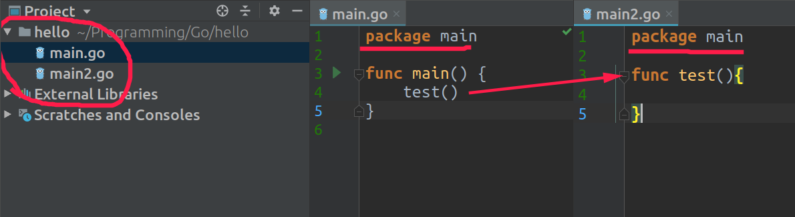
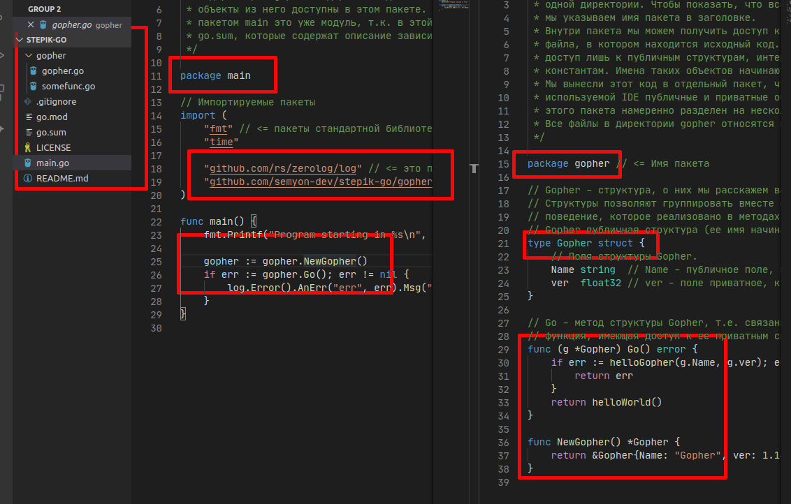

## Пакеты

Весь код в языке Go организуется в пакеты. Пакеты помогают разделить программу на логические модули, что упрощает разработку, тестирование и поддержку кода. Модульность позволяет создавать пакеты с определенной функциональностью и многократно использовать их в различных проектах.

Код каждого пакета хранится в одном или нескольких файлах с расширением `.go`. Пакет определяется с помощью ключевого слова `package`. Например:

```go
package main

import "fmt"

func main() {
    fmt.Println("Hello Go")
}

                  
```

В данном случае пакет называется `main`. Важно, что определение пакета всегда должно быть указано в начале файла.

Существует два типа пакетов:

- **Исполняемые (executable)** — пакеты, которые могут быть скомпилированы в исполняемый файл. Для таких пакетов имя должно быть `main`. В этом пакете обязательно должна быть функция `main`, которая является точкой входа в программу.
- **Библиотеки (reusable)** — пакеты, которые содержат функциональность, используемую другими программами. Эти пакеты не имеют функции `main` и не могут быть скомпилированы в исполняемый файл.

### Импорт пакетов

Для использования функциональности, которая уже реализована в других пакетах, можно подключить эти пакеты с помощью оператора `import`. Например, чтобы использовать функцию `Println` для вывода сообщений на консоль из стандартного пакета `fmt`, необходимо импортировать его:

```go
import "fmt"

                  
```

Если нужно подключить несколько пакетов, их можно импортировать по одному:

```go
package main

import "fmt"
import "math"

func main() {
    fmt.Println(math.Sqrt(16))  // 4
}

                  
```

В данном примере мы импортируем стандартный пакет `math` для использования функции `Sqrt()`, которая возвращает квадратный корень числа.

Для сокращения записи импорта можно объединить несколько пакетов в один блок, заключив их в круглые скобки:

```go
package main

import (
    "fmt"
    "math"
)

func main() {
    fmt.Println(math.Sqrt(16))  // 4
}

                  
```

Таким образом, можно импортировать как встроенные пакеты, так и собственные. Это позволяет легко и удобно подключать необходимые библиотеки и модули.

Полный список встроенных пакетов Go можно найти на официальной странице https://golang.org/pkg/.

### Создание своих пакетов

Кроме использования встроенных пакетов, Go позволяет создавать собственные пакеты для организации кода. Для этого нужно создать папку с названием пакета и в этой папке разместить файлы с кодом, которые будут определять его функциональность. Каждый файл должен начинаться с ключевого слова `package`, указывающего на его принадлежность к определенному пакету.

Пример создания собственного пакета:

```go
// файл mathutils.go
package mathutils

func Add(a, b int) int {
    return a + b
}

                  
```

Затем этот пакет можно использовать в других частях программы, подключив его через `import`:

```go
package main

import (
    "fmt"
    "path/to/your/package/mathutils" // Указываем путь к вашему пакету
)

func main() {
    result := mathutils.Add(2, 3)
    fmt.Println(result)  // 5
}

                  
```

Важно помнить, что имена функций, которые должны быть доступны из других пакетов, должны начинаться с заглавной буквы. Это означает, что эти элементы являются экспортируемыми.

Если вы знакомы с другими языками программирования, вам возможно знакомы конструкции типа таких:

```cpp
using namespace std  // C++
                  
from math import *   # python
                  
```

Они позволяют использовать функции из импортируемых пакетов без указания имени самого пакета. **Хотя это считается не самой лучшей практикой**, тем не менее в Go есть аналогичный способ импорта - импорт с точкой:

```go
package main

import . "fmt"

func main() {
    Println("Hello, Go!")
}
                  
```

или же:

```go
package main

import (
    . "fmt"
)

func main() {
    Println("Hello, Go!")
}
                  
```

Импорт с точкой добавляет все экспортируемые поля пакета в текущий скоуп (точнее говоря область видимости файла). И теперь вы можете работать с полями импортированного пакет так, как будто они у вас в пакете.

 

## Импорт c синонимом

Так же мы можем присвоить импорту "синоним" - то есть заменить fmt на другое слово при использовании этого пакета.

```go
package main

import custom "fmt"

func main() {
	custom.Println("Hello!")
}

                  
```

Пакеты импортируют, задавая синонимы, в нескольких случаях:

- Имя импортируемого пакета неудобное/некрасивое/… и хочется использовать другое;
- Имя импортируемого пересекается с именем другого пакета;
- Хочется бесшовно подменить пакет — интерфейсы пакетов должны совпадать.

Большие программы принято разделять на пакеты, чтобы упростить её чтение.

Создадим в проекте два файла: один - main.go, другой - main2.go. Но оба файла лежат в одном пакете, потому что мы прописали package main. Поэтому мы без импорта можем вызывать функции из другого файла.



 

Для запуска программы выше необходимо указать **все файлы пакета main** через пробел**:**
 

```go
go run main.go main2.go
```

##  Модули

С ростом проекта вам захочется обособить логически завершенную часть кода, скрыть внутреннюю реализацию отдельных функций и методов, локальные константы и пр., оставив "торчать наружу" лишь публичные интерфейсы, структуры, функции и переменные. Тогда вы можете использовать несколько пакетов в одном проекте. Запомните, что **приватные и публичные объекты отличаются тем, что имена публичных объектов должны начинаться с большой буквы!**



А далее становится сложно следить за зависимостями такого проекта, особенно сложно тем разработчикам, которые используют уже ваш проект. Что делать? В настоящее время правильным способом организации даже небольших проектов является модуль.

Модуль, это коллекция пакетов, распространяемых вместе (возможно это компоненты одной программы или одной библиотеки). В корне модуля находится файл go.mod, в котором записано имя модуля, версия Go, в которой он был написан, а также пути ко всем импортированным в модуле пакетам. Модуль включает в себя пакеты, находящиеся ниже корневой директории даже в том случае, если сами эти пакеты содержат файл go.mod. Посмотрите на предыдущий скриншот или в импортированный вами модуль проекта - в нем присутствуют файлы go.mod и go.sum, это говорит о том, что проект распространяется как модуль.

Ранее Go предполагал, что пользователь создаст определенную структуру директорий, которую будет использовать для разработки всех своих проектов:

```css
go/
├── bin
├── pkg
└── src
                  
```

На директорию go указывала переменная окружения GOPATH:

- для **Windows** это обычно C:\Users\имя_пользователя\go
- для **GNU/Linux** это обычно /home/имя_пользователя/go

Проекты, которые располагались не в директории go/src имели проблемы при компиляции. Модули изменили положение дел. Вместе с тем, если вы не разработчик огромной корпорации, разумно придерживаться определенных правил по размещению кода в приведенных директориях. Кроме того, разработчики go рекомендуют размещать проект таким образом, как будто вы публикуете его во внешнем репозитории (даже если вы так не делаете).

Если вы хотите сделать все правильно, то алгоритм ваших действий примерно таков:

Создать проект в папке /src/ваш_любой_ник/имя_проекта. Если у вас уже есть github аккаунт то можете создать проект так: /src/github.com/username/имя_проекта.

*Примечание: github.com и username всего-лишь формальности, это не обязательно должно совпадать с вашим аккаунтом, на github ничего автоматически не отправится. Код вы храните только локально.* 

Модуль инициализируется следующим образом:

```go
// name не обязателен
go mod init <name> // инициализировать новый модуль в текущем каталоге

// другие команды
go mod download    скачать модули в локальный кеш
go mod edit        редактировать go.mod из инструментов или скриптов
go mod graph       напечатать граф требований модуля
go mod tidy        добавить отсутствующие и удалить неиспользуемые модули
go mod vendor      делает вендорную копию зависимостей
go mod verify      проверить зависимости ожидаемого содержания
go mod why         объяснять, зачем нужны пакеты или модули
                  
```

**Примечание!**

Тема организации кода не проста, т.к. каждый использует свою операционную систему, переменные окружения, организацию рабочего кода. Поэтому обязательно прочитайте [эту статью](https://golang.org/doc/code.html) и попробуйте произвести все действия самостоятельно. Если возникнут какие-то проблемы, мы ответим на них в комментариях.

**Кроме того**, для примера мы предлагаем вам скачать тестовый модуль из репозиория на GitHub, сделать это можно командой:

```go
go get -u github.com/semyon-dev/stepik-go
```