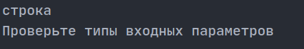
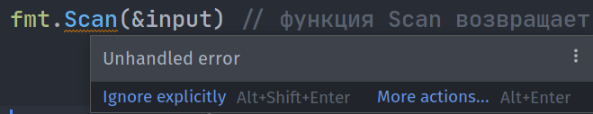

## **Обработка ошибок**

Хороший код должен правильно реагировать на непредвиденные обстоятельства, такие как ввод некорректных данных пользователем, разрыв сетевого подключения или отказ дисков. *Обработка ошибок* — это процесс обнаружения ситуаций, когда программа находится в неожиданном состоянии, а также принятие мер для записи диагностической информации, которая будет полезна при последующей отладке.

В отличие от других языков программирования, где ошибки обрабатываются с помощью специального синтаксиса (например, `try/catch` или `try/except`), в Go ошибки — это значения с типом `error`, возвращаемые функциями, как и любые другие значения. Для обработки ошибок в Go нужно проверять ошибки, которые могут возвращать функции, и решать, существует ли ошибка. В случае её наличия необходимо принять меры для защиты данных и сообщить пользователям или операторам о произошедшей проблеме.

Самая простая обработка ошибок — это проверка на пустоту. Многие функции и методы в Go при вызове возвращают не только основной результат, но и ошибку. Рассмотрим следующий пример, в котором функция делит одно число на другое:

```go
package main

import "fmt"

func divide(a int, b int) int {
	return a / b
}

func main() {
	var input int
	fmt.Scan(&input)
	fmt.Println(divide(input, 5)) // Выведем результат
}

                  
```

Однако стоит учитывать, что пользователь может ввести некорректное значение. Например, если вместо целого числа (тип `int`) будет подан строковый ввод, программа может сломаться. Чтобы предотвратить это, можно использовать проверку ошибки:

```go
package main

import "fmt"

func divide(a int, b int) int {
	return a / b
}

func main() {
	var input int
	_, err := fmt.Scan(&input) // fmt.Scan возвращает два параметра, первый — это количество считанных значений, второй — ошибка
	if err != nil {
		fmt.Println("Проверьте типы входных параметров.")
	} else {
		fmt.Println(divide(input, 5)) // Выводим результат, если ошибок нет
	}
}

                  
```

Теперь, если пользователь введет значение неверного типа, программа выведет дружелюбное сообщение:



Как видите, если переменная `err` не равна `nil`, то произошла ошибка. В противном случае — ошибок нет, и программа продолжает выполнение.

Игнорирование ошибок — плохая практика. Поэтому в Go функции, которые могут вернуть ошибку, всегда требуют явной проверки. IDE, такие как GoLand, подсказывают, если ошибка не была обработана. Это помогает избежать неожиданных сбоев в программе.



## Создание ошибок

Стандартная библиотека предоставляет две встроенные функции для создания ошибок: `errors.New` и `fmt.Errorf`. Обе эти функции позволяют нам указывать настраиваемое сообщение об ошибке, которое вы можете отображать вашим пользователям.

`errors.New` получает один аргумент — сообщение об ошибке в виде строки, которую вы можете настроить, чтобы предупредить ваших пользователей о том, что пошло не так.

Попробуйте запустить следующий пример, чтобы увидеть ошибку, созданную с помощью `errors.New`, которая выполняет стандартный вывод:

```go
package main

import (
    "errors"
    "fmt"
)

func main() {
    err := errors.New("my error")
    fmt.Println("", err)
}
                  
```

Мы использовали функцию `errors.New` из стандартной библиотеки для создания нового сообщения об ошибке со строкой `"my error"` в качестве сообщения об ошибке. Мы выполняли требование конвенции, используя строчные буквы для сообщения об ошибке, как показано в [руководстве по стилю для языка программирования Go](https://go.dev/wiki/CodeReviewComments#error-strings).

# Оператор panic

Оператор **panic** позволяет сгенерировать ошибку и выйти из программы:

```go
package main
import "fmt"

func main() {
    fmt.Println(divide(15, 5)) // Работает нормально
    fmt.Println(divide(4, 0))  // Генерирует ошибку
    fmt.Println("Program has been finished") // Не выполнится
}

func divide(x, y float64) float64 {
    if y == 0 {
        panic("division by zero!") // Генерация ошибки
    }
    return x / y
}

                  
```

Оператору `panic` можно передавать любое сообщение, которое будет выведено на консоль. Например, в функции `divide`, если второй параметр равен 0, вызывается `panic("division by zero!")`.

В функции `main`, при вызове `fmt.Println(divide(4, 0))`, будет сгенерирована ошибка, так как второй параметр функции `divide` равен 0. После этого выполнение программы будет остановлено, и все последующие операции, такие как вызов `fmt.Println("Program has been finished")`, не будут выполнены. В результате будет выведено следующее:

```vbnet
3
panic: division by zero!


                  
```

После вывода сообщения об ошибке будет отображена диагностическая информация о том, где именно возникла ошибка.

## В чем преимущество значений ошибок Go по сравнению с исключениями?

Go подталкивает разработчиков к тому, чтобы они поняли причину ошибок, что приводит к более понятным программам, в то время как исключения обычно игнорируются по умолчанию. Значения ошибок не требуют специальных ключевых слов, делая их более простыми и в то же время гибкими.

# Оператор defer

Оператор **defer** позволяет выполнить определенную операцию после выполнения других действий (даже если сработает `panic`), при этом не важно, где в реальности вызывается эта функция. Рассмотрим пример:

```go
package main
import "fmt"

func main() {
    defer finish() // Отложенный вызов функции finish
    fmt.Println("Program has been started")
    fmt.Println("Program is working")
}

func finish() {
    fmt.Println("Program has been finished")
}

                  
```

В этом примере функция `finish` вызывается с оператором `defer`, что означает, что она будет выполнена в самом конце выполнения программы, независимо от того, где в реальности был вызван этот оператор. Таким образом, консольный вывод будет следующим:

```
Program has been started
Program is working
Program has been finished
```

Если несколько функций вызываются с оператором `defer`, то те функции, которые были отложены раньше, выполнятся позже всех. Например:

```go
package main
import "fmt"

func main() {
    defer finish() // Этот вызов отложен
    defer fmt.Println("Program has been started") // Этот вызов отложен
    fmt.Println("Program is working")
}

func finish() {
    fmt.Println("Program has been finished")
}

                  
```

Консольный вывод в этом случае будет следующим:

```
Program is working
Program has been started
Program has been finished
```

*Дополнение:* Команда `defer` помещает вызов функции в стек. Поэтому вызовы функций выполняются в очередности **LIFO** (Last-In, First-Out), то есть последняя отложенная функция будет выполнена первой.

**Важно:** Оператор `defer` запоминает значения переменных, переданных в функцию, на момент объявления `defer`, а не на момент её вызова. Это означает, что значение переменной будет захвачено сразу, как только вы объявите отложенный вызов. Например:

```go
a := 5
defer myFunc(a) // Когда вызовется myFunc, будет передано значение 5, а не 7
a = 7
```