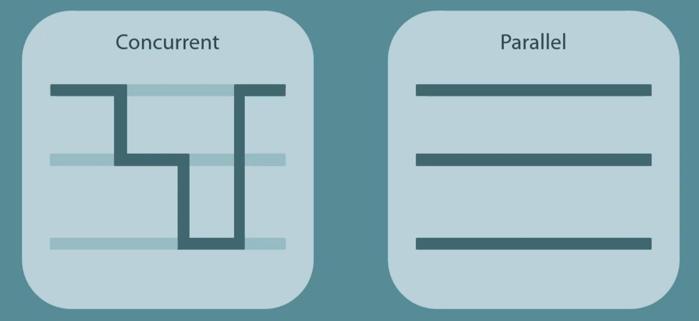
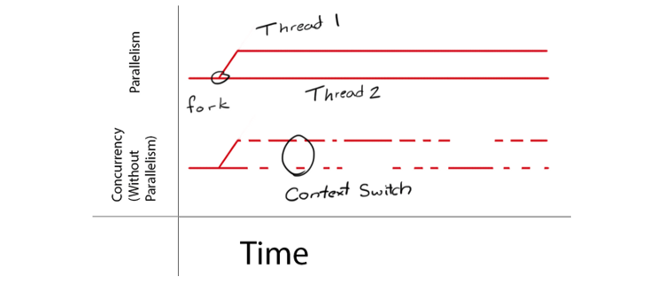
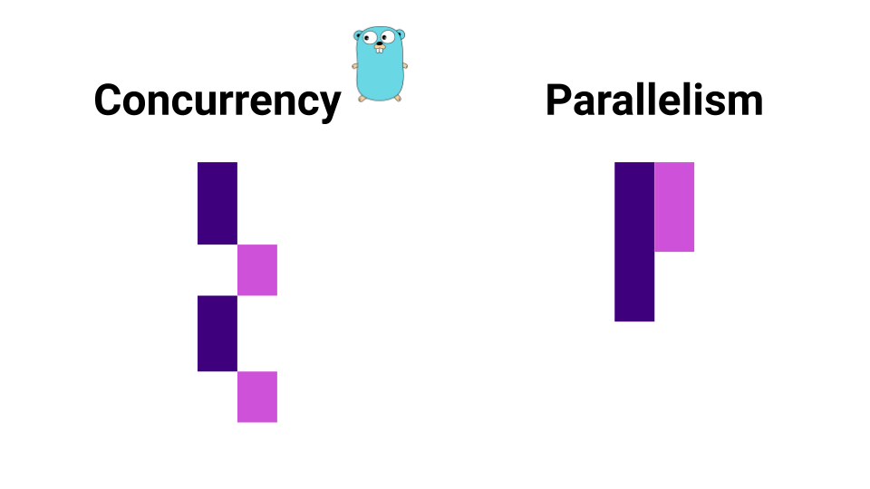

# Внимание!

**Параллелизм, многопоточность** и все что с этим связано - довольно объемная и сложная тема. **Перед тем как перейти к** параллелизму в Go необходимо понять что такое потоки и многопоточность в целом. Поэтому если вы впервые столкнулись с этим - мы рекомендуем сначала понять основы многопоточности. Например почитать [эту статью](https://habr.com/ru/post/337528/).

*К сожалению* на stepik сложно придумать задачи по программированию на параллелизм из-за того что данную тему сложно проверять через ввод/вывод. Практикуйтесь самостоятельно и пробуйте если в чем-то сомневаетесь. Мы будем стараться улучшать урок и добавлять задачи если это потребуется (впрочем, как и везде). 

# Конкурентность (Concurrency) и Параллелизм (Parallelism)

Конкурентность и параллелизм — два важных концепта многозадачности, которые часто используются в контексте многопоточного программирования. В Go существует принцип, гласящий: *«Concurrency is not Parallelism»*, что означает, что конкурентность — это не обязательно параллельное выполнение задач. Это концептуальные различия в том, как мы проектируем программу и как она выполняется.

Конкурентность предполагает возможность выполнения нескольких задач в рамках одного приложения. Даже если процессор имеет только одно ядро, можно организовать выполнение нескольких процессов, которые будут чередоваться и казаться запущенными одновременно.

Пример использования конкурентных задач можно привести на примере интернет-магазина. Допустим, для обеспечения лучшего пользовательского опыта необходимо одновременно обновлять:

1. Баннер с актуальными предложениями на главной странице.
2. Количество пользователей, которые сейчас находятся на сайте.
3. Содержимое корзины пользователя при добавлении новых товаров.
4. Таймер до начала следующей распродажи и другие важные элементы.

Каждая из этих задач выполняется независимо, но все они должны быть активны одновременно, чтобы обеспечить оптимальный опыт для пользователей. Однако важно понимать, что конкурентность не означает, что задачи выполняются параллельно. В некоторых случаях, например на одном ядре, задачи могут чередоваться, создавая иллюзию параллельности.

Давайте разберём, как это работает подробнее.

# Конкурентное и параллельное выполнение

## Конкурентное выполнение на одноядерной системе

Предположим, у нас есть система с одним процессорным ядром. В этом случае одновременно может выполняться только одна задача. Несмотря на это, в конкурентных приложениях задачи могут переключаться между собой за счет быстрого контекстного переключения. Кажется, что задачи выполняются одновременно, хотя на самом деле в каждый момент времени выполняется только одна из них.

Этот процесс переключения контекста даёт иллюзию параллельного выполнения, однако физически задачи по-прежнему выполняются по очереди, и количество параллельных операций ограничено количеством ядер процессора.

## Добавление параллелизма

Если мы добавим больше процессорных ядер, система сможет выполнять несколько задач одновременно на разных ядрах. Таким образом, задачи будут действительно выполняться параллельно, а не поочередно, как в модели конкурентности. Это дает реальный прирост производительности, так как задачи могут быть обработаны одновременно.

Теперь, если система многозадачна и имеет несколько ядер, конкурирующие задачи могут выполняться одновременно, а не по очереди. Это позволяет максимально эффективно использовать ресурсы системы, а значит, ускоряет выполнение программы.

Хотя конкурентность и параллелизм — это схожие понятия, их ключевая разница заключается в том, как именно задачи управляются и выполняются. Конкурентность касается того, как задачи организуются и управляются, тогда как параллелизм описывает, как задачи выполняются одновременно, используя доступные ресурсы.

Таким образом, в Go можно легко масштабировать приложение, постепенно переходя от конкурентного исполнения к параллельному, что позволяет эффективно использовать многозадачность и многопроцессорные системы.

