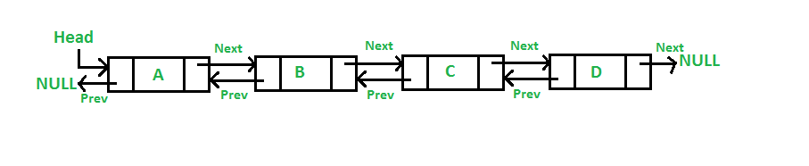

## Списки

Двусвязные списки (или двунаправленные списки) - это структура данных, которая позволяет хранить и организовывать элементы данных в виде последовательности, где каждый элемент, помимо ссылки на следующий элемент, также содержит ссылку на предыдущий элемент. Это делает вставку и удаление из списка быстрыми, но замедляет итерацию.

Простыми словами, представьте себе цепочку связанных контейнеров или коробок, где каждая коробка помимо своего содержимого (например, число, текст или другие данные) имеет две дополнительные метки или ярлыка. Один ярлык указывает на предыдущую коробку, а второй — на следующую коробку в цепочке.

Если вы работали с такими списками в C++, то можете помнить что там они реализованы в `std::list`.

 


В Go мы можем создать двусвязный список используя пакет `"container/list"`:

```go
package main

import (
	"container/list"
	"fmt"
)

func main() {
	// Создаем список
	mylist := list.New()
	// Добавляем каждый элемент в конец
	mylist.PushBack(1)
	mylist.PushBack(2)
	mylist.PushBack(3)
	// Пробегаемся по списку и печатаем не пустые элементы
	// Мы не можем пробежаться привычным способом как с массивами,
	// поэтому придется использовать метод Front() 
	// которая вернет первый элемент и затем с помощью Next
	// получать следующий элемент пока он не будет равен nil, что означает конец списка
	for temp := mylist.Front(); temp != nil; temp = temp.Next() {
		fmt.Println(temp.Value)
	}
}
                  
```

Вывод:

```undefined
1
2
3

                  
```

В предыдущем примере мы использовали метод `PushBack()` который вставлял элементы в конец списка, теперь попробуем `PushFront()` который вставляет в начало: 

```go
package main

import (
	"container/list"
	"fmt"
)

func main() {
	// Создаем список
	mylist := list.New()
	// Добавляем каждый элемент в начало
	mylist.PushFront(1)
	mylist.PushFront(2)
	mylist.PushFront(3)
	// Пробегаемся по списку и печатаем не пустые элементы
	for temp := mylist.Front(); temp != nil; temp = temp.Next() {
		fmt.Println(temp.Value)
	}
}
                  
```

Вывод:

```undefined
3
2
1
```

## Удаление элементов из списка

Для удаления элемента воспользуемся методом `Remove()`, но он принимает не значение, а **указатель** на элемент:

```go
package main

import (
	"container/list"
	"fmt"
)

func printList(l *list.List) {
	for temp := l.Front(); temp != nil; temp = temp.Next() {
		fmt.Printf("%v ", temp.Value)
	}
}

func main() {
	// Создаем список
	mylist := list.New()
	// Добавляем три элемента
	mylist.PushBack(0)
	mylist.PushBack(1)
	mylist.PushBack(2)
	mylist.PushBack(3)
	// получаем указатель на элемент который добавили (*Element)
	elem3 := mylist.PushBack(4)
	printList(mylist)
	// удаляем элемент '3' по указателю (*Element)
	mylist.Remove(elem3)
	// так же можем воспользоваться методом Front()/Back() чтобы получить первый/последний элемент
	mylist.Remove(mylist.Front())
	fmt.Printf("\nПосле удаления:\n")
	printList(mylist)
}
                  
```

Вывод:

```go
0 1 2 3 4
После удаления:
1 2 3

                  
```

Функция `Remove()` получает указатель на элемент в списке, и мы можем использовать его в удобных ситуациях, когда мы хотим отфильтровывать элементы, которые не соответствуют определенному порогу в нашем связанном списке:

```go
package main

import (
	"container/list"
	"fmt"
)

func main() {
	// Создаем контейнер list и добавляем в него элементы
	myList := list.New()
	myList.PushBack(2)
	myList.PushBack(5)
	myList.PushBack(3)
	myList.PushBack(11)
	myList.PushBack(12)

	// Проходимся по элементам и удаляем те, которые меньше 10
	for e := myList.Front(); e != nil; {
		next := e.Next() // Запоминаем следующий элемент перед удалением текущего
		if e.Value.(int) < 10 {
			myList.Remove(e) // Удаляем текущий элемент из списка
		}
		e = next // Переходим к следующему элементу
	}

	// Выводим список после удаления элементов
	for e := myList.Front(); e != nil; e = e.Next() {
		fmt.Println(e.Value)
	}
}
                  
```

Вывод:

```undefined
11
12
```

Материалы для дальнейшего изучения:[Документация](https://golang.org/pkg/container/list/) 

------