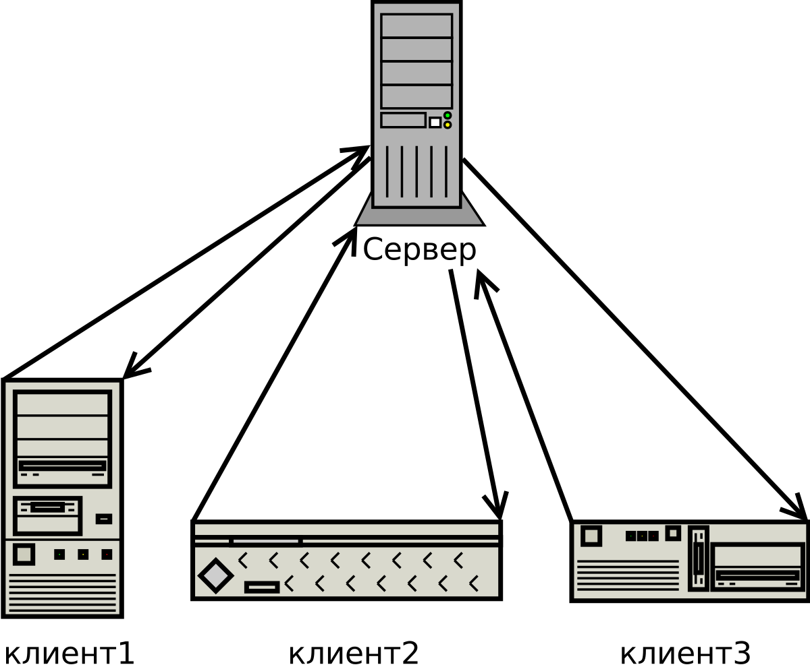
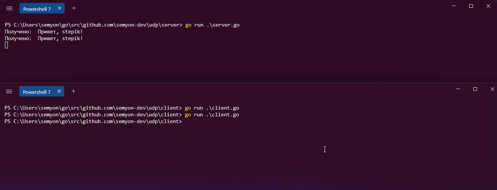
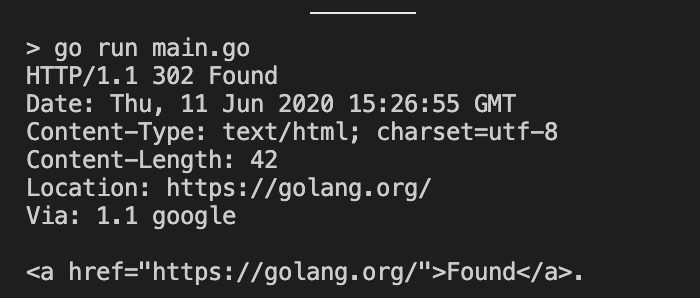
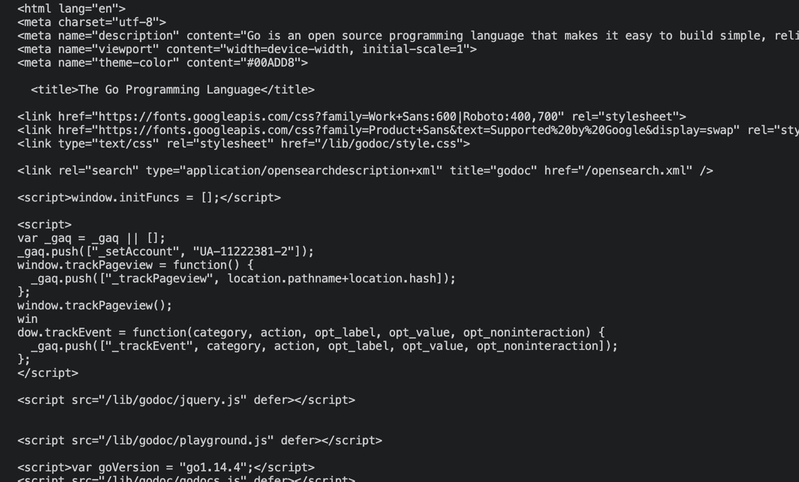
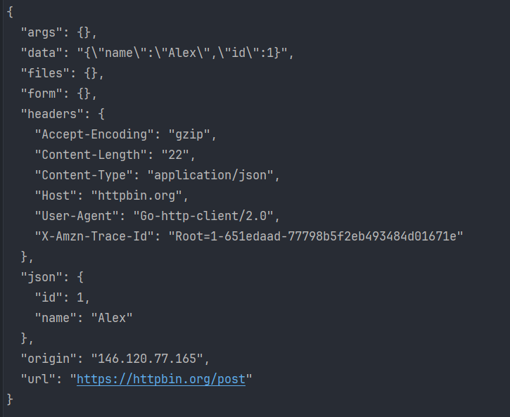

# ведение

Работа с сетью является обширной частью программирования на Go, но мы физически не можем описать каждый аспект этой тематики. Поэтому рекомендуется самостоятельно изучить основы сетевых протоколов и затем приступать к этому уроку. Но если вы уже знаете что такое TCP, UDP, HTTP, то можете смело приступать, в любом случае мы кратко напомним термины.

## Краткая теория

### Клиенты и серверы

«Клиент — сервер» — сетевая архитектура, в которой задания или сетевая нагрузка распределены между поставщиками услуг, называемыми серверами, и заказчиками услуг, называемыми клиентами. Фактически клиент и сервер — это программное обеспечение. 



 

## **TCP/UDP/IP/HTTP**

**Все эти протоколы реализовывают клиент-серверную-архитектуру**

1. **TCP (Transmission Control Protocol)**:
   - TCP - это надежный и устойчивый протокол передачи данных в сетях.
   - Он обеспечивает установление соединения между отправителем и получателем, а также обеспечивает гарантию доставки данных в правильном порядке и контроль ошибок.
   - TCP используется для приложений, которым важна надежная передача данных, таких как веб-серверы, электронная почта и файловые передачи.
2. **UDP (User Datagram Protocol)**:
   - UDP - это простой и быстрый протокол передачи данных в сетях.
   - Он не гарантирует надежную доставку данных, не устанавливает соединение и не контролирует порядок доставки.
   - UDP используется в приложениях, где небольшая потеря данных не критична, например, в видеозвонках и стриминге.
3. **IP (Internet Protocol)**:
   - IP - это протокол сетевого уровня, который используется для маршрутизации и доставки пакетов данных в сети.
   - Он обеспечивает адресацию и идентификацию устройств в сети с помощью IP-адресов.
   - IP работает вместе с протоколами более высоких уровней, такими как TCP и UDP, для доставки данных.
4. **HTTP (Hypertext Transfer Protocol)**:
   - HTTP - это протокол прикладного уровня, который используется для передачи данных между клиентом (например, веб-браузером) и веб-сервером.
   - Он основан на запросах и ответах и использует URL для адресации ресурсов в сети.
   - HTTP часто используется для загрузки веб-страниц, передачи данных между веб-сервисами и обмена информацией в веб-приложениях.

Кратко говоря, TCP обеспечивает надежную передачу данных, UDP предоставляет быструю передачу с меньшей надежностью, IP обеспечивает маршрутизацию и адресацию в сети, а HTTP используется для веб-коммуникаций.

# Пакет net

Go предоставляет удобные средства для работы с сетью через свою стандартную библиотеку. Для подключения к серверу по сети используется пакет **net**, а именно функции `Dial`, `DialTCP`, `DialUDP`, `DialIP` и другие.

Рассмотрим универсальную функцию `Dial`, которая принимает два параметра: *network* — тип протокола и *address* — адрес ресурса.

Существует несколько типов протоколов, которые поддерживаются пакетом `net`:

- `tcp, tcp4, tcp6`: Протокол TCP. По умолчанию `tcp` соответствует `tcp4`, а цифры указывают на тип используемых IP-адресов: IPv4 или IPv6.
- `udp, udp4, udp6`: Протокол UDP. По умолчанию `udp` представляет `udp4`.
- `ip, ip4, ip6`: Протокол IP. `ip` по умолчанию использует `ip4`.
- `unix, unixgram, unixpacket`: Сокеты Unix.

Второй параметр функции `Dial` может быть как доменным именем, так и числовым адресом, включающим порт. Пример подключения к TCP-серверу:

```go
conn, err := net.Dial("tcp", "0.0.0.0:8081")
if err != nil {
    log.Println(err)
}
defer conn.Close()
                  
```

Чтобы прочитать сообщение от сервера, используем следующий код:

```go
message := make([]byte, 1024) // создаём буфер
n, err := conn.Read(message)
if err != nil {
    log.Println(err)
}
fmt.Println(string(message[:n])) // выводим полученное сообщение
                  
```

Функция `net.Dial` возвращает объект типа `net.Conn`, который реализует интерфейсы `io.Reader` и `io.Writer`. Это значит, что с этим объектом можно как читать, так и записывать данные. Например, `conn.Read(message)` позволяет читать данные, а `conn.Write(message)` — записывать.

Так как `net.Conn` реализует интерфейс `io.Reader`, его можно передать в функцию `io.Copy` для чтения данных, например, на консоль:

```go
io.Copy(os.Stdout, conn)
                  
```

**Важно:** не забудьте обрабатывать только те байты, которые действительно были получены. Например, если буфер размером 1024 байта, но фактически данные могут быть меньше, то мы извлекаем только те байты, которые были прочитаны:

```go
fmt.Println(string(message[:n]))
                  
```

Теперь создадим сервер. Если в предыдущем примере мы подключались к серверу как клиент, то здесь рассмотрим реализацию сервера:

```go
// Создаём слушатель для порта
ln, err := net.Listen("tcp", "0.0.0.0:8081")
if err != nil {
    log.Println(err)
}
defer ln.Close()

// Принимаем входящие подключения
conn, err := ln.Accept()
if err != nil {
    log.Println(err)
}
_, err = conn.Write([]byte("message"))
if err != nil {
    log.Println(err)
}
                  
```

- `net.Listen()` используется для создания слушателя на определённом сетевом адресе, например, IP-адресе и порте, с целью ожидания входящих подключений.
- Эта функция создаёт серверный сокет, который может принимать соединения от клиентов.
- Слушатель возвращает интерфейс `net.Listener`, с помощью которого можно принимать подключения и обрабатывать их.

Пример выше обрабатывает только одно соединение. Для работы с несколькими соединениями одновременно можно использовать горутины. Пример с многозадачностью:

```go
listener, err := net.Listen("tcp", "localhost:8080")
if err != nil {
    fmt.Println("Error:", err)
    return
}
defer listener.Close()

for {
    conn, err := listener.Accept()
    if err != nil {
        fmt.Println("Error:", err)
        continue
    }
    go handleConnection(conn) // Обработка соединения в отдельной горутине
}
```

# UDP 

Теперь попробуем написать UDP-сервер, надо описать сам сервер и клиент. Для этого заведем такую структуру проекта.

udp
├── client
│  └── client.go
└── server
  └── server.go

Начнем с сервера. 

#### *server.go*

```go
package main

import (
	"fmt"
	"log"
	"net"
)

func main() {
	serverConn, err := net.ListenUDP("udp", &net.UDPAddr{IP: []byte{0, 0, 0, 0}, Port: 10001})
	if err != nil {
		log.Fatalln(err)
	}
	defer serverConn.Close()
	for {
		buf := make([]byte, 1024)
		n, _, err := serverConn.ReadFromUDP(buf)
		if err != nil {
			log.Println(err)
		}
		fmt.Println("Получено: ", string(buf[:n]))
	}
}

                  
```

В этом коде также используется пакет *net,* но уже другой метод - ListenUDP, он будет мониторить порт 10001 и как только на него поступит запрос, он его выведет в терминал.

#### *client.go*

```go
package main

import (
	"log"
	"net"
)

func main() {
	conn, err := net.DialUDP("udp", nil, &net.UDPAddr{IP: []byte{127, 0, 0, 1}, Port: 10001})
	if err != nil {
		log.Fatalln(err)
	}
	defer conn.Close()
	message := "Привет, stepik!"
	_, err = conn.Write([]byte(message))
	if err != nil {
		log.Println(err)
	}
}

                  
```

В данном случае мы объявляем соединение по 127.0.0.1, так как это адрес локальной сети. Далее запускаем клиент и сервер отдельно. Когда запрос придет на сервер, он обработает его и мы увидим результат (для наглядности запуск клиента был 2 раза):



# Таймауты

В процессе взаимодействия между клиентом и сервером можно установить таймауты, по истечении которых соединение будет разорвано, если не произошло взаимодействия. Для этого тип `net.Conn` предоставляет несколько методов:

- `SetDeadline(t time.Time) error`: устанавливает таймаут для всех операций ввода-вывода. Время задаётся с помощью структуры `time.Time`.
- `SetReadDeadline(t time.Time) error`: устанавливает таймаут только для операций чтения из потока.
- `SetWriteDeadline(t time.Time) error`: устанавливает таймаут для операций записи в поток.

Рассмотрим, как эти методы могут быть полезны в реальной ситуации. В предыдущем разделе мы рассматривали пример, когда сервер читает данные от клиента, используя буфер фиксированного размера в 1024 байта. Теперь добавим таймауты, чтобы сервер не зависал в случае, если данные от клиента не поступают в течение длительного времени.

```go
package main

import (
	"fmt"
	"net"
	"time"
)

func main() {
	// Подключаемся к серверу
	conn, err := net.Dial("tcp", "127.0.0.1:4545")
	if err != nil {
		fmt.Println(err)
		return
	}
	defer conn.Close()

	for {
		var source string
		// Запрашиваем у пользователя ввод
		fmt.Print("Введите слово: ")
		_, err := fmt.Scan(&source)
		if err != nil {
			fmt.Println("Некорректный ввод", err)
			continue
		}

		// Отправляем сообщение
		if n, err := conn.Write([]byte(source)); n == 0 || err != nil {
			fmt.Println(err)
			return
		}

		// Устанавливаем таймаут на чтение ответа
		fmt.Println("Ответ:")
		conn.SetReadDeadline(time.Now().Add(time.Second * 5))

		// Чтение данных в отдельном цикле
		// Если сервер пришлет больше данных, они будут обработаны
		for {
			buff := make([]byte, 1024)
			n, err := conn.Read(buff)
			if err != nil {
				break
			}
			fmt.Print(string(buff[0:n]))

			// Сбрасываем таймаут до 700 миллисекунд после первых 1024 байт
			conn.SetReadDeadline(time.Now().Add(time.Millisecond * 700))
		}
	}
}

                  
```

В строке `conn.SetReadDeadline(time.Now().Add(time.Second * 5))` устанавливается таймаут на чтение данных — если сервер не отправит данные в течение 5 секунд, операция чтения выбросит ошибку и выйдет из цикла. Это значение может быть изменено в зависимости от требований. В данном примере 5 секунд — это довольно долгий период ожидания, который можно уменьшить после первого взаимодействия.

После того как первые 1024 байта будут получены, таймаут сбрасывается до 700 миллисекунд с помощью строки `conn.SetReadDeadline(time.Now().Add(time.Millisecond * 700))`. Это означает, что если сервер не отправит новых данных в течение 700 миллисекунд, чтение завершится.

# HTTP

**HTTP** — широко распространённый протокол передачи данных. Этот протокол описывает взаимодействие между двумя компьютерами (клиентом и сервером), построенное на базе сообщений, называемых запрос (Request) и ответ (Response). Каждое сообщение состоит из трех частей: стартовая строка, заголовки и тело. При этом обязательной является только стартовая строка, которая выглядит вот так:

*METHOD URI* HTTP/*VERSION*

Где:

METHOD: GET, POST, PUT, DELETE и тд ([подробнее о методах](https://developer.mozilla.org/ru/docs/Web/HTTP/Methods)) 

URI - Uniform Resource Identifier — единообразный идентификатор ресурса, или по-человечески ссылка.

VERSION - версия протокола

Если вы первый раз слышите про HTTP - [рекомендуем прочитать это](https://selectel.ru/blog/http-request/).

## Go & HTTP

Протокол HTTP работает поверх TCP, поэтому необходимо лишь придерживаться спецификации — оправить в теле запроса определенные данные. Так писать неудобно, но мы оставили этот пример для показательности.

```go
package main
import (
    "fmt"
    "os"
    "net"
    "io"
)
func main() {
    httpRequest:="GET / HTTP/1.1\n" + 
        "Host: golang.org\n\n"
    conn, err := net.Dial("tcp", "golang.org:80") 
    if err != nil { 
        fmt.Println(err) 
        return
    } 
    defer conn.Close() 
  
    if _, err = conn.Write([]byte(httpRequest)); err != nil { 
        fmt.Println(err) 
        return
    }
  
    io.Copy(os.Stdout, conn) 
    fmt.Println("Done")
}
                  
```

Так как `net.Conn` реализует интерфейсы `io.Reader` и `io.Writer`, то в данный объект можно записывать данные. Например, `conn.Write([]byte(httpRequest))` посылает данные, которые здесь представлены переменной httpRequest. Так как метод Write отправляет срез байтов, то любые данные обязательно преобразовать в срез байтов.

Как и любой объект `io.Reader`, мы можем передать `net.Conn` в функцию `io.Copy` и считать полученные по сети данные, например, на консоль: `io.Copy(os.Stdout, conn)`. Этот код достаточно линеен: надо просто описать HTTP-запрос, указать адрес обращения и получить данные.



**Однако** можно это сделать в несколько раз проще с `net/http,` об этом пакете в следующем шаге.

## Пакет net/http

Для удобной работы с http запросами, есть отдельный пакет net/http с рядом функций:

- `Get(url string) (resp *Response, err error)`: отправляет запрос GET 
- `Head(url string) (resp *Response, err error)`: отправляет запрос HEAD
- `Post(url string, contentType string, body io.Reader) (resp *Response, err error)`: отправляет запрос POST
- `PostForm(url string, data url.Values) (resp *Response, err error)`: отправляет форму в запросе POST
- `NewRequest(method, url string, body io.Reader) (*Request, error)`: для нестандартных методов: PUT, DELETE, PATCH

## **Метод GET**

Перепишем пример из прошлого шага на net/http

```go
package main

import (
	"fmt"
	"io"
	"log"
	"net/http"
)

func main() {
	// http запрос с методом GET
	resp, err := http.Get("https://golang.org")
	if err != nil {
		log.Println(err)
		return
	}
	defer resp.Body.Close() // закрываем тело ответа после работы с ним

	data, err := io.ReadAll(resp.Body) // читаем ответ
	if err != nil {
		log.Println(err)
		return
	}

	fmt.Printf("%s", data) // печатаем ответ как строку
}

                  
```

Функция`http.Get()` принимает адрес ресурса, к которому надо выполнить запрос. А возвращает объект `*http.Response`, который инкапсулирует ответ. Поле Body структуры `http.Response`представляет ответ от веб-ресурса и при этом также реализует интерфейс `io.ReadCloser`. А это значит, что это поле по сути является потоком для чтения, и мы можем считать пришедшие данные через функцию `io.ReadAll `которая прочитает все данные. Для того чтобы закрыть поток, необходимо вызвать метод Close, используя defer мы закроем его в любом случае: `defer resp.Body.Close()`. 

*Заметьте, в первом примере, в ответе указан `Content-Type: text/html`. В этом случае ответ и есть html-страница:*



## Работа с телом запроса

В HTTP запрос для методов POST, PUT (и др.) можно добавить тело запроса, давайте попробуем это сделать:

```go
package main

import (
	"bytes"
	"encoding/json"
	"fmt"
	"io"
	"log"
	"net/http"
)

// User - структура для представления объекта пользователя
type User struct {
	Name string `json:"name"`
	ID   uint32 `json:"id"`
}

func main() {
	// Создаем экземпляр структуры User
	var u = User{
		Name: "Alex",
		ID:   1,
	}

	// Кодируем структуру User в JSON (байтовый срез)
	bytesRepresentation, err := json.Marshal(u)
	if err != nil {
		log.Fatalln(err)
	}

	// Отправляем POST-запрос на сервер с JSON-телом
	resp, err := http.Post("https://httpbin.org/post", "application/json", bytes.NewBuffer(bytesRepresentation))
	if err != nil {
		log.Fatalln(err)
	}

	// Читаем и конвертируем тело ответа в байты
	bytesResp, err := io.ReadAll(resp.Body)
	if err != nil {
		log.Println(err)
		return
	}

	// Выводим содержимое тела ответа
	fmt.Println(string(bytesResp))
}

                  
```

Сначала преобразуем нашу структуру данных в байтовый срез, содержащий JSON-представление данных.

Затем мы делаем запрос POST, используя функцию **http.Post**. Мы передаем url, наш тип контента (**application/json**), а затем мы создаем и передаем новый объект **bytes.Buffer** из нашей переменной **bytesRepresentation**. Зачем нам здесь создавать буфер? Функция **http.Post** ожидает реализации io.Reader. Поэтому мы могли бы даже прочитать эту часть с диска или сети. В нашем случае мы можем просто создать буфер байтов, который реализует интерфейс io.Reader. Мы отправляем запрос и проверяем наличие ошибок.

**В консоли мы увидим это:**



Мы получили много данных в виде JSON, хоть мы и печатали просто строку. Давайте теперь попробуем декодировать этот JSON в нашу структуру. Для этого опишем структуру Output с некоторыми полями которые мы ждем от сервера, также пропишем json тэги.

```go
package main

import (
	"bytes"
	"encoding/json"
	"fmt"
	"io"
	"log"
	"net/http"
)

// User - структура для представления объекта пользователя
type User struct {
	Name string `json:"name"`
	ID   uint32 `json:"id"`
}

// Output - структура для представления ответа сервера
type Output struct {
	JSON struct {
		Name string `json:"name"`
		ID   uint32 `json:"id"`
	} `json:"json"`
	URL string `json:"url"`
}

func main() {
	// Создаем экземпляр структуры User
	var u = User{
		Name: "Alex",
		ID:   1,
	}

	// Кодируем структуру User в JSON
	bytesRepresentation, err := json.Marshal(u)
	if err != nil {
		log.Fatalln(err)
	}

	// Отправляем POST-запрос на сервер с JSON-телом
	resp, err := http.Post("https://httpbin.org/post", "application/json", bytes.NewBuffer(bytesRepresentation))
	if err != nil {
		log.Fatalln(err)
	}

	// Читаем и конвертируем тело ответа в байты
	bytesResp, err := io.ReadAll(resp.Body)
	if err != nil {
		log.Println(err)
		return
	}

	// Создаем экземпляр ответа сервера
	var out Output
	// Декодируeм данные в формате JSON и заполняем структуру
	err = json.Unmarshal(bytesResp, &out)
	if err != nil {
		log.Println(err)
		return
	}
	fmt.Printf("%+v\n", out) // печатаем ответ в виде структуры
	fmt.Println(out.URL)     // печатаем конкретное поле структуры
}

                  
```

Вывод:

```ruby
{JSON:{Name:Alex ID:1} URL:https://httpbin.org/post}
https://httpbin.org/post

                  
```

То-есть мы не просто получили тело ответа в виде строки или байтов, а теперь имеем доступ к конкретным полям у конкретной структуры. Это удобно когда вам нужно анализировать ответ сервера. 

## http.PostForm

Для отправки данных в виде формы у нас есть удобная функция http.PostForm. Эта функция принимает два параметра **url** и **url.Values** из пакета net/url. **url.Values** - это объект, который содержит ключи в виде строк и каждый ключ может содержать несколько строковых значений ([]string). В запросе формы вы можете отправить несколько значений по одному имени поля. Вот почему это фрагмент строки, а не только ключ к значению сопоставления. Чтобы получить наши значения, надо считать его из переменной result, и обратиться к нему по ключу.

```go
package main

import (
	"encoding/json"
	"log"
	"net/http"
	"net/url"
)

func main() {

	formData := url.Values{
		"name":     {"hello"},
		"surename": {"golang post form"},
	}

	resp, err := http.PostForm("https://httpbin.org/post", formData)
	if err != nil {
		log.Fatalln(err)
	}

	var result map[string]interface{}

	json.NewDecoder(resp.Body).Decode(&result)

	log.Println(result["form"])
}

                  
```

Затем мы объявляем переменную result (которая также является типом map) для хранения результатов, возвращаемых из запроса. Сначала мы могли прочитать полное тело (как и в предыдущем примере), а затем сделать json.Unmarshal на нем. Однако, поскольку resp.Body возвращает объект io.Reader, мы можем просто передать его json.NewDecoder, а затем вызвать функцию Decode на нем. Помните, мы должны передать указатель на наш объект map, поэтому мы передали переменную как &result вместо result. Функция Decode также возвращает вторым параметром ошибку. Но мы предполагали, что это не имеет значения и не проверяем ее. Мы зарегистрировали result и result["data"]. httpbin отправляет различную информацию о запросе в качестве ответа.

## Query параметры

В строке запроса можно передать набор параметров, которые помещаются в адресе после вопросительного знака. При этом каждый параметр определяет название и значение. Например, в адресе: localhost:3000/user?name=Sam&id=16.

Часть ?name=Sam&id=16 представляет строку запроса, в которой есть два query параметра name и id. Для каждого параметра определено имя и значение, которые отделяются знаком равно. Параметр name имеет значение "Sam", а параметр id - значение 16. Друг от друга параметры отделяются знаком амперсанда.

```go
package main

import (
	"fmt"
	"net/http"
	"net/url"
)

func main() {
	// Создаем URL с параметрами
	baseURL := "https://example.com/api/resource"
	params := url.Values{}
	params.Add("param1", "value1")
	params.Add("param2", "value2")

	fullURL := baseURL + "?" + params.Encode()

	// Отправляем GET-запрос
	response, err := http.Get(fullURL)
	if err != nil {
		fmt.Println("Ошибка при отправке GET-запроса:", err)
		return
	}
	defer response.Body.Close()

	// Чтение ответа
	// ...

	// Обработка ответа
	// ...
}

                  
```

### Также можно "собрать" URL с query параметрами

В этом примере мы не отправляем запрос, а просто создаем ссылку с параметрами которую позже можно будет использовать в любых методах.

```go
package main

import (
	"fmt"
	"log"
	"net/url"
)

func main() {
	// Парсим базовый URL "https://www.example.com"
	base, err := url.Parse("https://www.example.com")
	if err != nil {
		log.Println(err)
		return
	}

	// Добавляем путь к базовому URL, создавая "https://www.example.com/path"
	base.Path += "path"

	// Создаем query параметры запроса
	params := url.Values{}
	params.Add("id", "15")
	params.Add("name", "Dima")

	// Кодируем параметры запроса в строку и устанавливаем как часть запроса в URL
	base.RawQuery = params.Encode()

	// Выводим итоговый URL
	fmt.Printf("Encoded URL is %q\n", base.String())
}
                  
```

Вывод: `Encoded URL is "https://www.example.com/path?id=15&name=Dima"`

## http.NewRequest()

На практике вам может понадобиться не только методы GET/POST/HEAD, но и DELETE/PUT/PATCH. Функция http.NewRequest() является более гибкой и многофункциональной. С ней удобно отправлять сложные запросы, с кастомными заголовками, query параметрами и другими фишками.

Принято, что ` DELETE` удаляет, а [`PUT`](https://developer.mozilla.org/ru/docs/Web/HTTP/Methods/PUT) позволяет полную замену документа. [Подробнее о различиях методах тут](https://developer.mozilla.org/ru/docs/Web/HTTP/Methods).
Воспользуемся демонстративным API для обновления ресурса - https://jsonplaceholder.typicode.com/

```go
package main

import (
	"bytes"
	"encoding/json"
	"fmt"
	"io"
	"log"
	"net/http"
)

// Todo - структура для представления объекта Todo
type Todo struct {
	UserID    int    `json:"userId"`
	ID        int    `json:"id"`
	Title     string `json:"title"`
	Completed bool   `json:"completed"`
}

func main() {
	// Создаем экземпляр структуры Todo
	todo := Todo{
		UserID:    1,
		ID:        2,
		Title:     "наш title",
		Completed: true,
	}

	// Кодируем структуру Todo в формат JSON
	jsonReq, err := json.Marshal(todo)
	if err != nil {
		log.Println(err)
		return
	}

	// URL сервера
	baseURL := "https://jsonplaceholder.typicode.com/posts/1"

	// Создаем новый HTTP-запрос с методом POST
	req, err := http.NewRequest("POST", baseURL, bytes.NewBuffer(jsonReq))
	if err != nil {
		log.Println("Ошибка при создании запроса:", err)
		return
	}

	// Устанавливаем заголовки запроса
	req.Header.Set("Content-Type", "application/json; charset=UTF-8")

	// Отправляем запрос
	client := &http.Client{}        // создаем http клиент
	response, err := client.Do(req) // передаем выше подготовленный запрос на отправку
	if err != nil {
		log.Println("Ошибка при выполнении запроса: ", err)
		return
	}

	defer response.Body.Close() // не забываем закрыть тело

	// Читаем и конвертируем тело ответа в байты
	bodyBytes, err := io.ReadAll(response.Body)
	if err != nil {
		log.Println(err)
	}

	// Конвертируем тело ответа в строку и выводим
	bodyString := string(bodyBytes)
	fmt.Printf("API ответ в форме строки: %s\n", bodyString)

	// Конвертируем тело ответа в Todo struct
	var todoStruct Todo
	err = json.Unmarshal(bodyBytes, &todoStruct)
	if err != nil {
		log.Println(err)
	}

	// Выводим структуру Todo
	fmt.Printf("API ответ в форме struct:\n%+v\n", todoStruct)

	// Вывод статуса ответа (если 200 - то успешный)
	fmt.Println("Статус ответа:", response.Status)
}
                  
```

**Вывод:**

```cpp
API ответ в форме строки: {
  "userId": 1,
  "id": 1,
  "title": "наш title",
  "completed": true
}
API ответ в форме struct:
{UserID:1 ID:1 Title:наш title Completed:true}
Статус ответа: 200 OK
```

# Памятка

### **Всегда закрывайте тело ответа**

Когда мы делаем HTTP-запрос, мы получаем ответ и ошибку. Если не закрывать тело ответа, соединение может оставаться открытым и вызывать утечку ресурсов.

### **Используйте таймаут**

Попробуйте использовать свой собственный клиент http и установите тайм-аут. Не настраивая тайм-аут вы можете блокировать соединение и горутины и, невзначай вызывать хаос. 

### **Статус-коды**

Код ответа (состояния) HTTP показывает, был ли успешно выполнен определённый HTTP запрос. Коды сгруппированы в 5 классов:

1. Информационные 100 - 199
2. Успешные 200 - 299
3. Перенаправления 300 - 399
4. Клиентские ошибки 400 - 499
5. Серверные ошибки 500 - 599

Подробнее - https://developer.mozilla.org/ru/docs/Web/HTTP/Status 