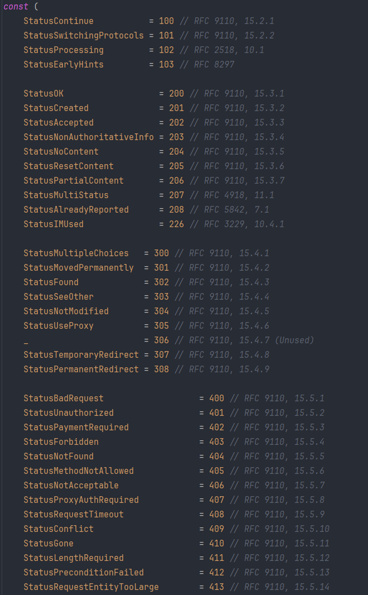

# Go & веб сервера

В прошлом уроке мы делали http запросы, а в этом будем сами писать сервера и обрабатывать запросы от клиентов.

Как вы уже знаете для работы с http используется пакет `net/http`, напишем hello-world, используя модуль http:

```go
package main

import (
	"fmt"
	"net/http"
)

// Обработчик HTTP-запросов
func handler(w http.ResponseWriter, r *http.Request) {
	w.Write([]byte("Привет, Stepik!"))
}

func main() {
	// Регистрируем обработчик для пути "/"
	http.HandleFunc("/", handler)

	// Запускаем веб-сервер на порту 8080
	err := http.ListenAndServe(":8080", nil)
	if err != nil {
		fmt.Println("Ошибка запуска сервера:", err)
	}
}

                  
```

Перейдя по ссылке [http://localhost:8080](http://localhost:8080/) в браузере, вы увидите сообщение "Привет, stepik!". Рассмотрим данный код подробнее:

`http.HandleFunc` - регистрирует обработчик и принимает функцию которая должна принимать `http.ResponseWriter, *http.Request.` ResponseWriter это интерфейс который нужен, для того чтобы отвечать клиенту. У него есть метод `Write([]byte)` с помощью которого мы и отвечаем "Привет, Stepik!". А вот `*http.Request` уже конкретная структура, в которой содержится информация о запросе, от туда мы можем узнать много информации, включая метод, URL, тело запроса и тд. Давайте попробуем вывести информацию о запросе:

```go
package main

import (
	"fmt"
	"net/http"
)

// Обработчик HTTP-запросов
func handler(w http.ResponseWriter, r *http.Request) {
	fmt.Println(r.Method) // Тип метода
	fmt.Println(r.URL)    // запрашиваемый URL
	fmt.Println(r.Proto)  // версия протокола
	w.Write([]byte("Привет, Stepik!"))
}

func main() {
	// Регистрируем обработчик для пути "/"
	http.HandleFunc("/", handler)

	// Запускаем веб-сервер на порту 8080
	err := http.ListenAndServe(":8080", nil)
	if err != nil {
		fmt.Println("Ошибка запуска сервера:", err)
	}
}

                  
```

Вывод:

```sql
GET
/
HTTP/1.1

                  
```

Как вы уже знаете есть разные методы HTTP, рассмотрим код, который обрабатывает разные методы. Воспользуемся полем Method из объекта `*http.Request:`

```go
package main

import (
	"fmt"
	"net/http"
)

func main() {
	// Регистрируем обработчики для разных путей
	http.HandleFunc("/", handleRequest)

	// Запускаем веб-сервер на порту 8080
	err := http.ListenAndServe(":8080", nil)
	if err != nil {
		fmt.Println("Ошибка запуска сервера:", err)
	}
}

func handleRequest(w http.ResponseWriter, r *http.Request) {
	// В зависимости от метода HTTP-запроса вызываем соответствующий обработчик
	switch r.Method {
	case http.MethodGet:
		handleGET(w, r)
	case http.MethodPost:
		handlePOST(w, r)
	case http.MethodPut:
		handlePUT(w, r)
	case http.MethodDelete:
		handleDELETE(w, r)
	default:
		http.Error(w, "Метод не поддерживается", http.StatusMethodNotAllowed)
	}
}

// Обработчик для GET-запросов
func handleGET(w http.ResponseWriter, r *http.Request) {
	fmt.Fprintln(w, "Это GET-запрос!")
}

// Обработчик для POST-запросов
func handlePOST(w http.ResponseWriter, r *http.Request) {
	fmt.Fprintln(w, "Это POST-запрос!")
}

// Обработчик для PUT-запросов
func handlePUT(w http.ResponseWriter, r *http.Request) {
	fmt.Fprintln(w, "Это PUT-запрос!")
}

// Обработчик для DELETE-запросов
func handleDELETE(w http.ResponseWriter, r *http.Request) {
	fmt.Fprintln(w, "Это DELETE-запрос!")
}

                  
```

 Напомним, что:

- GET - запрашивает представление ресурса. Запросы с использованием этого метода могут только извлекать данные.
- POST - используется для отправки сущностей к определённому ресурсу. Часто вызывает изменение состояния или какие-то побочные эффекты на сервере.
- PUT - заменяет все текущие представления ресурса данными запроса.
- DELETE - удаление данных на ресурсе
- HEAD - запрашивает ресурс так же, как и метод GET, но без тела ответа.
- PATCH - используется для частичного изменения ресурса.

# Query параметры

Если вы прошли прошлый урок, то должны помнить что такое query параметры. Тогда мы учились создавать их. Теперь давайте получим их со стороны сервера. Вначале надо получить запрошенный адрес через переменную `URL`. Далее у адреса вызывается метод `Query()`, который и возвращает строку запроса. Чтобы получить значение отдельного параметра, применяется метод `Get()`, в который передается имя параметра.

Например, получим данные строки запроса:

```go
package main

import (
	"fmt"
	"net/http"
)

// Обработчик HTTP-запросов
func handler(w http.ResponseWriter, r *http.Request) {
	fmt.Println("RawQuery: ", r.URL.String())           // URL с параметрами
	fmt.Println("Name: ", r.URL.Query().Get("name"))    // значение параметра
	fmt.Println("IsExist: ", r.URL.Query().Has("name")) // существует ли такой параметр
	w.Write([]byte("Привет, Stepik!"))
}

func main() {
	// Регистрируем обработчик для пути "/"
	http.HandleFunc("/", handler)

	// Запускаем веб-сервер на порту 8080
	err := http.ListenAndServe(":8080", nil)
	if err != nil {
		fmt.Println("Ошибка запуска сервера:", err)
	}
}

                  
```

Вывод:

```vbnet
RawQuery:  /?name=Semyon
Name:  Semyon
IsExist:  true
```

## Статус ответа

Как вы знаете у протокола HTTP есть статусы при ответе. По умолчанию Go сам обрабатывает некоторые из них, например если мы успешно приняли и ответили на запрос то браузер или клиент получит 200 код. Но давайте попробуем сами реализовать обработку:

```go
package main

import (
	"fmt"
	"net/http"
)

func handler(w http.ResponseWriter, r *http.Request) {
	w.Write([]byte("Привет!"))
	w.WriteHeader(200)
}

func handler2(w http.ResponseWriter, r *http.Request) {
	if r.Method == "PUT" {
		w.WriteHeader(http.StatusMethodNotAllowed) // вернем 405
		return
	}
	w.Write([]byte("Привет!"))
	w.WriteHeader(http.StatusOK) // одно и тоже что и 200
}

func main() {
	http.HandleFunc("/", handler)
	http.HandleFunc("/2", handler2)
	err := http.ListenAndServe(":3000", nil)
	if err != nil {
		fmt.Println("Ошибка запуска сервера:", err)
	}
}

                  
```

В handler2 если метод PUT то клиент получит 405 код — что означает метод не разрешен. 

В стандартной библиотеке все коды объявлены в пакете http, поэтому мы можем легко обращаться к ним:



# Собственные обработчики

### HTTP-обработчики

В прошлых шагах мы писали простые обработчики:

```go
// Обработчик HTTP-запросов
func handler(w http.ResponseWriter, r *http.Request) {
	w.Write([]byte("Привет, Stepik!"))
}
                  
```

Обработчик — это то, что принимает запрос и возвращает ответ. В Go обработчики реализуют интерфейс со следующей сигнатурой: 

```go
type Handler interface {
        ServeHTTP(ResponseWriter, *Request)
}
                  
```

Мы использовали `http.HandleFunc("/", handler)`, таким образом оборачивая другую функцию, принимающую `http.ResponseWriter` и `http.Request`, в `ServeHTTP`. Таким образом, обработчики формируют ответы на запросы. Для каждой цели в языке Go реализованы разные обработчики. 

Обработка HTTP-запросов в Go завязывается на двух вещах: ServeMux'ы и Handler'ы. На самом деле когда мы вызываем HandleFunc то под капотом используется стандартный `DefaultServeMux`

[ServeMux](http://golang.org/pkg/net/http/#ServeMux) - это HTTP-request роутер (или мультиплексор). Он сравнивает входящие запросы со списком предопределенных URL - путей и вызывает нужный обработчик, соответсвующий этому url-пути.

Handler'ы ответственны за написание ответов и тел запросов. Почти любой объект может быть handler'ом, покуда он удовлетворяет `http.Handler` интерфейсу. Проще говоря, он должен иметь метод `ServeHTTP` с последующей сигнатурой:

```
ServeHTTP(http.ResponseWriter, *http.Request)
```

Давайте напишем сервер со своим `serverMux`:

```go
package main

import (
	"fmt"
	"net/http"
)

func handler(w http.ResponseWriter, r *http.Request) {
	w.Write([]byte("OK!"))
}

func main() {
	// создаем свой serverMux
	serverMux := http.NewServeMux()
	serverMux.HandleFunc("/", handler)
	// Запускаем веб-сервер на порту 8080 с нашим serverMux (в прошлых примерах был nil)
	err := http.ListenAndServe(":8080", serverMux)
	if err != nil {
		fmt.Println("Ошибка запуска сервера:", err)
	}
}

                  
```

Кратко:

- В `main` мы используем `http.NewServeMux⁣, чтобы создать` пустой ServeMux.
- Потом мы используем  HandleFunc⁣, чтобы создать новый handler. Этот обработчик перенаправляет все запросы.
- В конце мы создаем сервер с помощью [`http.ListenAndServe`](http://golang.org/pkg/net/http/#ListenAndServe), передавая ServeMux, чтобы он мог контролировать запросы.

Сигнатура для ListenAndServe - `ListenAndServe(addr string, handler Handler)`, но мы передавали ServeMux  вторым параметром.

Мы можем это сделать, т.к ServeMux имеет `ServeHTTP` метод, это значит, что он удовлетворяет типу Handler.

ServeMux - особенный handler, он передает запрос другому обработчику. Связки обработчиков — обычная практика в Go.

Давайте создадим свой собственный обработчик, который возвращает дату на запрос:

```css
type timeHandler struct {
  format string
}

func (th *timeHandler) ServeHTTP(w http.ResponseWriter, r *http.Request) {
  tm := time.Now().Format(th.format)
  w.Write([]byte("The time is: " + tm))
}


                  
```

У нас есть структура `timeHandler`, и мы описали метод с сигнатурой `ServeHTTP(http.ResponseWriter, *http.Request)` в ней. Это все, что нам нужно, чтобы описать handler.

```go
func main() {
  mux := http.NewServeMux()

  th1123 := &timeHandler{format: time.RFC1123}
  mux.Handle("/time/rfc1123", th1123)

  th3339 := &timeHandler{format: time.RFC3339}
  mux.Handle("/time/rfc3339", th3339)

  log.Println("Listening...")
  http.ListenAndServe(":3000", mux)
}


                  
```

В функции `main` мы инициализировали `timeHandler` как любую другую структуру, используя `&` для инициализации указателя. И как в предыдущем примере, мы используем `mux.Handle⁣`, чтобы зарегистрировать наш ServeMux.

Когда мы запустим наше приложение, любой запрос к url `/time` будет обрабатываться `timeHandler.ServeHTTP` методом.

Заметьте, что мы можем переиспользовать `timeHandler` по разным url-путям:

В этом примере мы передаём простую строку в обработчик, но в настоящем приложении вы можете использовать такой подход, чтобы передавать шаблоны, соединения с базами данных, или другой контекст. Это хорошая альтернатива для глобальных переменных.

## Материалы для дальнейшего изучения веб серверов

- https://go.dev/doc/articles/wiki/
- https://habr.com/ru/companies/ruvds/articles/559816/
- https://habr.com/ru/articles/183508/