## Развертывание сервиса 

 В прошлых уроках веб сервер работал на локальном компьютере (в локальной сети), из-за этого есть некоторые минусы:

- Чаще всего локальный компьютер не работает 24/7, особенно, если это ноутбук, соответственно, сложнее обеспечить бесперебойную работу бота.
- Обращаться к вашему серверу нельзя из реального мира, нужно покупать и настраивать доступ с белым айпи адресом.
- Если вдруг сервер (ваше приложение) станет популярным — он начнет потреблять больше ресурсов, "отъедая" их у других ваших приложений и сервисов. То есть, есть сложности масштабирования.
- Нужно настраивать удаленный доступ к вашему компьютеру, чтобы иметь возможность что-то исправить или поменять в работе вашего бота, если вы находитесь не рядом.
- Можно просто забыть, что у вас на компьютере живет веб сервер, которым кто-то пользуется, и выключить компьютер.

В общем, если ваше веб приложение уже выросло из того возраста, когда его можно держать на локальном компьютере — ему нужен собственный хороший надежный домик. Вот, давайте с вами займемся постройкой/настройкой домика/сервера для вашего веб-сервера.

## Создание удаленного сервера

Первым делом нужно выбрать провайдера, который предоставляет услуги удаленного сервера. Предложений достаточно много, но мы будем показывать настройку и работу с удаленным сервером на базе провайдера [Selectel](https://selectel.ru/services/cloud/servers/?utm_source=stepik&utm_medium=referral&utm_campaign=help-programmirovanie-na-golang_021023_novikov_paid). Это удобный сервис с возможностью масштабирования в будущем. Вы можете выбрать любого другого провайдера, который вам больше понравится — принципы создания, настройки и взаимодействия с удаленным сервером будут похожи. Поэтому данный урок можно будет легко адаптировать под ваш выбор.

Заходим на сайт [Selectel](https://selectel.ru/services/cloud/servers/?utm_source=stepik&utm_medium=referral&utm_campaign=help-programmirovanie-na-golang_021023_novikov_paid) и регистрируемся. Процесс регистрации крайне прост, не нуждается в описании. Далее необходимо пополнить баланс:

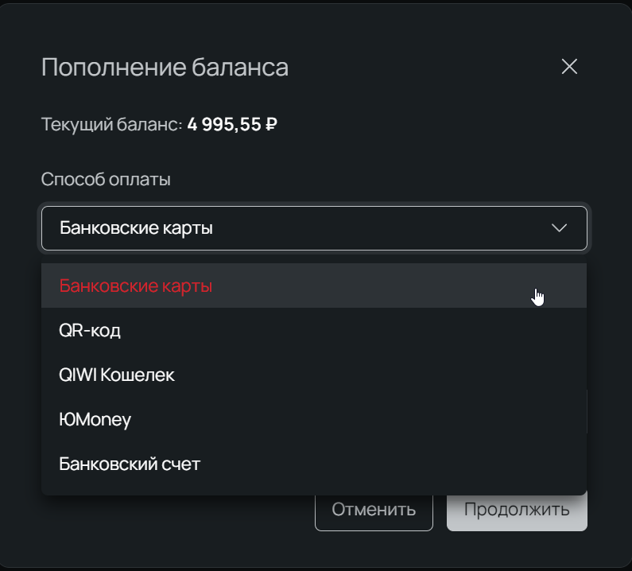

Далее слева выбираем **Облачная платформа**, затем **Серверы**. Затем жмите **Создать сервер. Имя** — любое, на ваш выбор. **Регион и пул —** выбирайте один из следующих пулов: ru-1b, ru-3b, ru-9a  в Санкт-Петербурге и ru-1b, ru-3b в Москве.

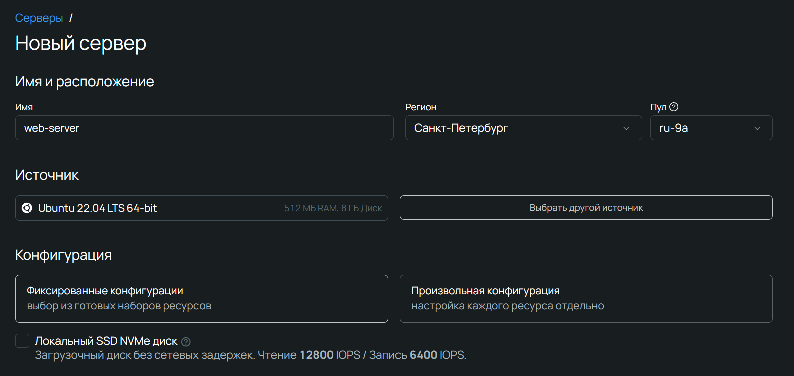

Во вкладке **Shared Line** выберите 20%, 1vCPU 1ГБ RAM. Дело в том, что у Selectel есть возможность арендовать часть мощности ядра процессора, чтобы не переплачивать на этапе, когда у вашего бота еще нет большого количества пользователей и, соответственно, нет нагрузки. А в случае, если выбранной конфигурации не будет хватать — всегда можно легко докупить дополнительных мощностей. Для наших экспериментов пока хватит 20-50% от одного ядра CPU. Этого хватит даже более чем для простых веб серверов, но вы можете выбрать что-то и помощнее.

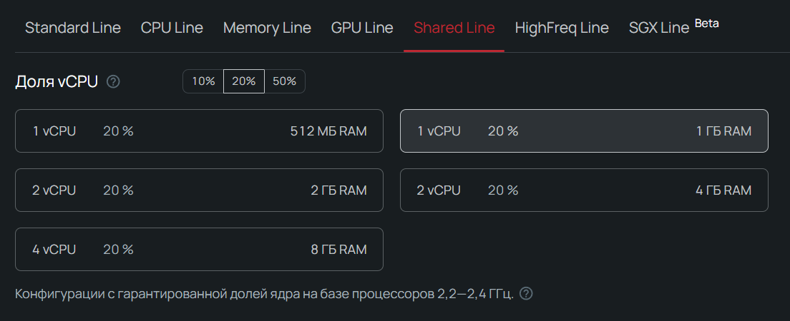

Далее нужно выбрать **размер диска**, под нашу задачу будет достаточно 7-10ГБ. Тип диска подойдет Универсальный SSD или же Базовый HDD.

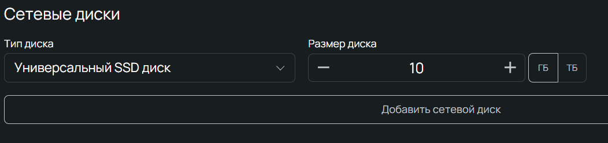

В разделе Сеть оставляем **Новый публичный IP-адрес**: Публичный IP нам понадобится, чтобы подключаться к серверу удаленно.

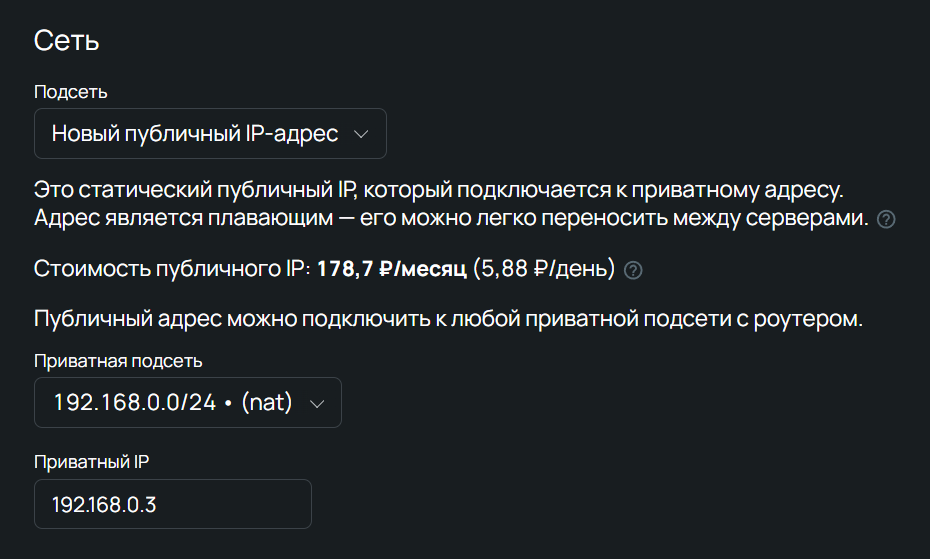

SSH-ключ не обязателен на данном этапе, но если вы разбираетесь в этом то можете создать и загрузить свой ключ.
Вот и все настройки! Нажимайте внизу страницы **Создать** и начнется создание сервера по вашей конфигурации.

Пройдет совсем немного времени и ваш сервер будет готов к работе. Справа будет гореть надпись ACTIVE.

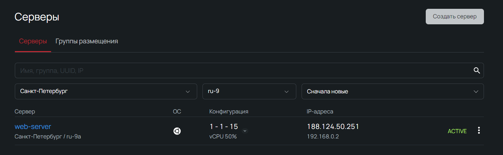

## Настройка удаленного сервера

Теперь подключимся к только что созданному серверу:
`ssh root@<IP адрес вашего сервера>`

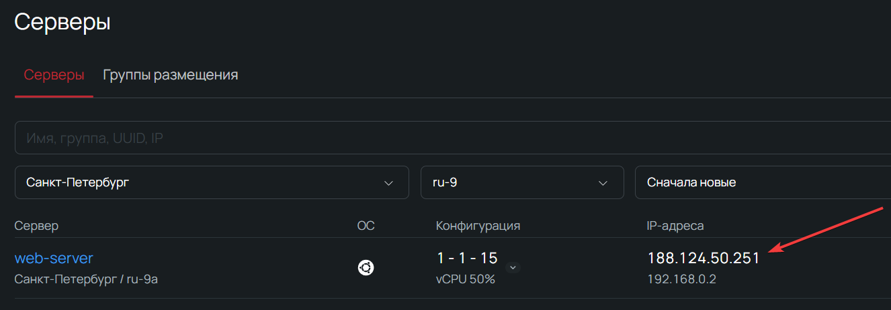

Нужно будет подтвердить, что вы соединяетесь с тем самым сервером, ответив "yes" на вопрос в терминале типа:  

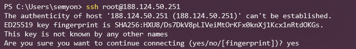

Далее сервер вас поприветствует:

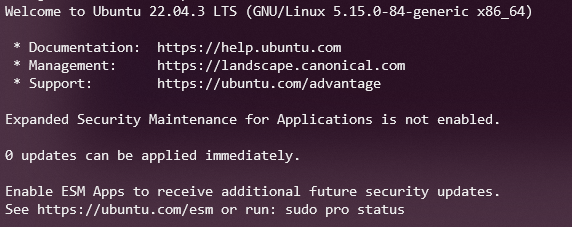

После этого необходимо обновить репозитории и ПО:

```
sudo apt update -y && sudo apt upgrade -y
```

Нам понадобиться git для развертывания проекта, поэтому установим его:

```
sudo apt install git -y
```

Помимо git, нам понадобиться docker. Про docker расскажем в следующем шаге, а пока давайте просто установим его.

**Устанавливаем дополнительные пакеты**

Для установки докера потребуется дополнительно загрузить 4 пакета, а именно:

- curl — необходим для работы с веб-ресурсами;
- software-properties-common — пакет для управления ПО с помощью скриптов;
- ca-certificates — содержит информацию о центрах сертификации;
- apt-transport-https — необходим для передачи данных по протоколу HTTPS.

Скачаем их:

```
sudo apt install curl software-properties-common ca-certificates apt-transport-https -y
```

**Импортируем GPG-ключ**

GPG-ключ нужен для верификации подписей ПО. Он понадобится для добавления репозитория докера в локальный список. Импортируем GPG-ключ:

```
curl -f -s -S -L https://download.docker.com/linux/ubuntu/gpg | sudo apt-key add -
```

**Добавляем репозиторий докера**

Добавим репозиторий для нашей версии Ubuntu, которая называется *«*Jammy*»*. Выполняем команду:

```
sudo add-apt-repository "deb [arch=amd64] https://download.docker.com/linux/ubuntu jammy stable"
```

Во время выполнения терминал попросит подтвердить выполнение операции. Нажимаем Enter.

После проведения всех манипуляций нам необходимо еще раз обновить индексы пакетов с помощью уже знакомой команды:

```
sudo apt update
```

**Проверяем репозиторий**

Убедимся, что инсталляция будет осуществлена из нужного нам репозитория. Выполняем следующую команду:

```
apt-cache policy docker-ce
```

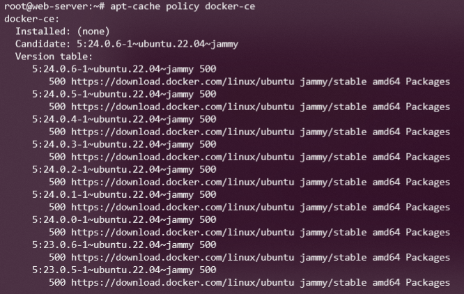

**Устанавливаем докер**

После осуществление всех манипуляций с репозиториями можно перейти непосредственно к установке:

```
sudo apt install docker-ce -y
```

После выполнения команды начнется установка докера.

Убедимся в успешности установки, проверив статус докера в системе:

```
sudo systemctl status docker
```

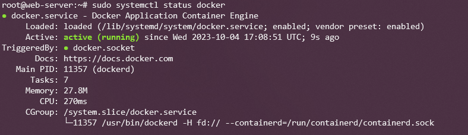

Как видим, всё в порядке: служба докера имеет статус Active(Running)

##  Развертывание (деплой)

Для того чтобы наш проект работал на удаленном сервере воспользуемся Docker. 

*Docker - это как виртуальная коробка, в которой у вас есть все, что нужно для работы программы: сама программа, ее зависимости и настройки. Вы можете взять эту коробку и запустить ее на любом компьютере, и она будет работать точно так же, как на вашем компьютере. Это делает управление программами и их развертывание на серверах проще и более надежным.*

Использование контейнеров Docker лучше, чем просто загрузка бинарного файла на сервер, потому что:

- **Портативность**: Docker контейнеры включают все, что нужно для работы приложения, и могут запускаться на разных компьютерах без проблем.
- **Управление зависимостями**: Dockerfile позволяет явно указать, какие компоненты приложения нужны, и не нужно заботиться о том, чтобы устанавливать их вручную.
- **Простота воспроизводства**: Dockerfile документирует, как создать контейнер, делая его создание и воспроизведение легкими.
- **Изоляция**: Docker контейнеры предоставляют безопасное окружение для приложения и предотвращают конфликты с другими приложениями.
- **Управление конфигурацией**: Docker упрощает изменение настроек вашего приложения через переменные среды.
- **Легкость обновления**: Обновление приложения в Docker сводится к созданию новой версии контейнера и его перезапуску.

Итак, Docker делает развертывание и управление вашим приложением проще и более надежным. Мы не будем подробно рассказывать про все возможности Docker, но кратко опишем команды в Dockerfile.

Напишем простой Dockerfile для нашего веб-сервера:

```go
# Используем готовый образ Golang версии 1.21.1 как основу для нашего контейнера
FROM golang:1.21.1

# Копируем все файлы из текущей директории (вашего проекта) в корневую директорию контейнера
COPY . /

# Устанавливаем рабочую директорию в корень контейнера
WORKDIR /

# Собираем ваш Go-проект (компилируем) с помощью команды go build и файлом main.go
RUN go build main.go

# Указываем команду, которая будет выполняться при запуске контейнера
CMD ["./main"]

# Открываем порт 8080, чтобы контейнер мог принимать входящие сетевые запросы на этом порту
EXPOSE 8080

                  
```

Создайте в корне проекта файл с названием "Dockerfile" (без расширения) и вставьте содержимое выше. 

Теперь можно приступать к запуску нашего веб сервера. Один из самых простых и удобных способов это git + github. Мы запушим наш проект в репозиторий и далее будем его клонировать на наш удаленный сервер. Но перед этим нужно создать токен доступа, зайдите в настройки github, далее в Developer settings и создайте персональный токен доступа.

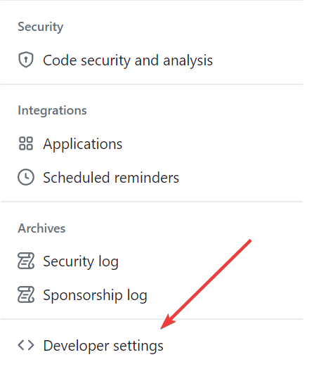

Придумайте имя, выберите время жизни (в моем случае это 90 дней). А также не забудьте выделить права, для того чтобы работать с вашими репозиториями.

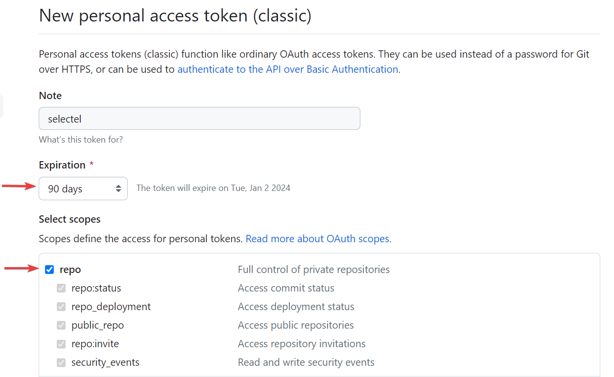

После создания скопируйте токен, он понадобиться. Далее создайте на github репозиторий (можно приватный, можно публичный):

 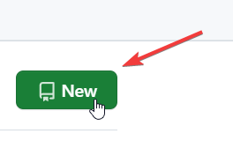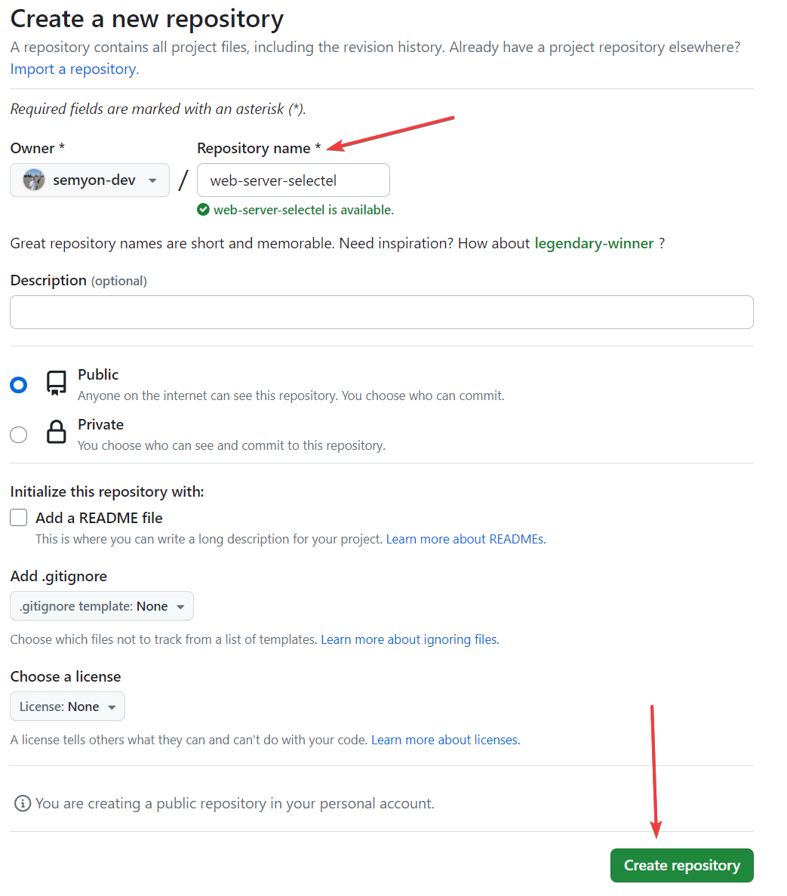

Теперь нужно запушить в репозиторий ваш код ([пример](https://github.com/semyon-dev/web-server) моего репозитория). Выполняем команды локально на вашем компьютере.

Инициализируем репозиторий:

```
git init
```

Добавим все файлы:

```
git add .
```

Далее создаем коммит (сохраняем изменения локально):

```
git commit -am "init commit"
```

Свяжем ваш локальный Git-репозиторий с удаленным репозиторием на сервере github:

```
git remote add origin <ваша ссылка на репозиторий>
```

Ссылку можно найти на экране после создания репозитория:

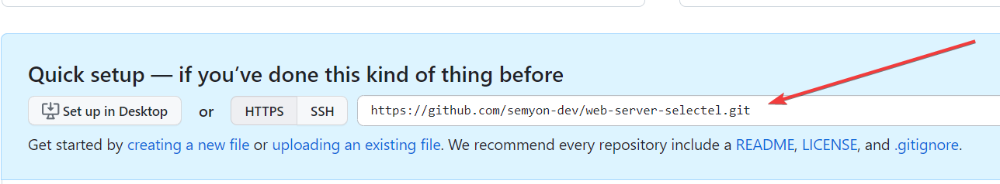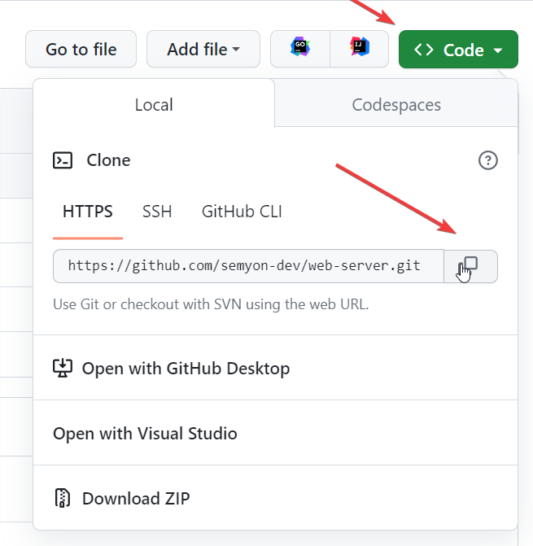

Пример: 

```csharp
git remote add origin https://github.com/semyon-dev/web-server-selectel.git
                  
```

И отправляем наши изменения на github: (если git запроси пароль — вставьте персональный токен который мы создали ранее)

```
git push origin master
```

Теперь заходим на сервер (как и в прошлом шаге):

```
ssh root@<IP адрес вашего сервера>
```

Далее переходим в домашнюю директорию:

```
cd /home
```

Клонируем проект:

```
git clone <ваша ссылка на репозиторий>
```

Переходим в папку с файлами проекта (команда ls подскажет какие файлы и папки есть в данной директории)

```
cd <название проекта>
```

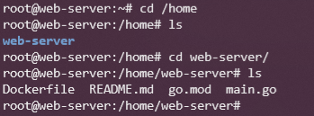

Наконец, собираем и запускаем наш проект с прокидыванием порта 8080 (или другой ваш порт):

```vbscript
docker build -t web-server . && docker run -d -p 8080:8080 web-server
                  
```

**Важно**, в коде где вы запускаете веб сервер `http.ListenAndServe(":8080", nil)` должны быть указан тот же порт что и в команде выше. 

Если вы сделали все правильно, то перейдя по IP адресу и указав нужный порт вы увидите ответ вашего веб сервера по пути /

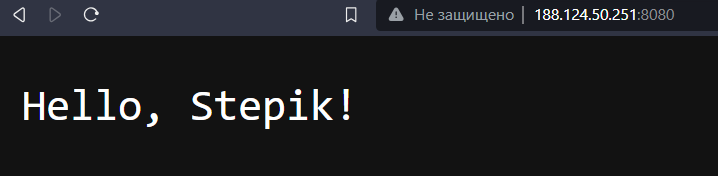